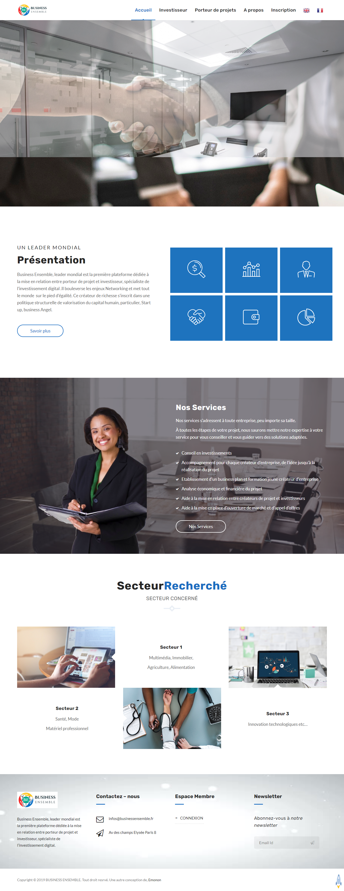

# Business Ensemble

This project consists of building a crowdfunding platform that links entrepreneurs and investors.

## Description

###Admin
* Can perform CRUD operations on users and assign roles to them
* Can perform CRUD operations on projects, project categories, pricings

###Entrepreneurs
* Can perform CRUD operations on their own projects
* Can send messages to users

##Investors
* Can save a project
* Can send message to users
* Can send money to other users

## Guest/Visitor
* Can view listing of all the projects
* Can register as an investor or entrepreneur

## Built With

- Laravel 7
- JQuery 3
- Bootstrap 4
- Librairies: Quill Editor, Font Awesome

## Live Demo

[Live Demo Link](https://businessensemble.fr/)

## Authors

👤 **David YAO**

- GitHub: [@daviidy](https://github.com/daviidy)
- Twitter: [@davidyao3](https://twitter.com/DavidYao3)
- LinkedIn: [@daviidy](https://www.linkedin.com/in/david-yao-6bb95299/)
- Personal Website: [@daviidy](http://david-yao.com)

## 🤝 Contributing

Contributions, issues, and feature requests are welcome!

Feel free to check the [issues page](issues/).

## Show your support

Give a ⭐️ if you like this project!

# How to use the repository ?

## 1- Connect

- install composer on your system
- install git on your system
- clone the repo by using: <code>git clone repo_url</code>
- ##Windows users:

- Download wamp: http://www.wampserver.com/en/
- Download and extract cmder mini: https://github.com/cmderdev/cmder/releases/download/v1.1.4.1/cmder_mini.zip
- Update windows environment variable path to point to your php install folder (inside wamp installation dir) (here is how you can do this http://stackoverflow.com/questions/17727436/how-to-properly-set-php-environment-variable-to-run-commands-in-git-bash)
- cmder will be refered as console

## 2- Install Laravel

##Mac Os, Ubuntu and windows users continue here:

- Create a database locally
- Download composer https://getcomposer.org/download/
- Pull Laravel/php project from git provider.
- Rename .env.example file to .envinside your project root and fill the database information. (windows wont let you do it, so you have to open your console cd your project root directory and run mv .env.example .env )
- Open the console and cd your project root directory
- Run <code>composer install</code> or php composer.phar install
- Run <code>php artisan key:generate</code>
- Run <code>php artisan migrate</code>
- Run <code>php artisan db:seed</code> to run seeders, if any.
- Run <code>php artisan serve</code>

#####You can now access your project at localhost:8000 :)

## About Laravel

Laravel is a web application framework with expressive, elegant syntax. We believe development must be an enjoyable and creative experience to be truly fulfilling. Laravel takes the pain out of development by easing common tasks used in many web projects, such as:

- [Simple, fast routing engine](https://laravel.com/docs/routing).
- [Powerful dependency injection container](https://laravel.com/docs/container).
- Multiple back-ends for [session](https://laravel.com/docs/session) and [cache](https://laravel.com/docs/cache) storage.
- Expressive, intuitive [database ORM](https://laravel.com/docs/eloquent).
- Database agnostic [schema migrations](https://laravel.com/docs/migrations).
- [Robust background job processing](https://laravel.com/docs/queues).
- [Real-time event broadcasting](https://laravel.com/docs/broadcasting).

Laravel is accessible, powerful, and provides tools required for large, robust applications.

## Learning Laravel

Laravel has the most extensive and thorough [documentation](https://laravel.com/docs) and video tutorial library of all modern web application frameworks, making it a breeze to get started with the framework.

If you don't feel like reading, [Laracasts](https://laracasts.com) can help. Laracasts contains over 1500 video tutorials on a range of topics including Laravel, modern PHP, unit testing, and JavaScript. Boost your skills by digging into our comprehensive video library.

## Laravel Sponsors

We would like to extend our thanks to the following sponsors for funding Laravel development. If you are interested in becoming a sponsor, please visit the Laravel [Patreon page](https://patreon.com/taylorotwell).

- **[Vehikl](https://vehikl.com/)**
- **[Tighten Co.](https://tighten.co)**
- **[Kirschbaum Development Group](https://kirschbaumdevelopment.com)**
- **[64 Robots](https://64robots.com)**
- **[Cubet Techno Labs](https://cubettech.com)**
- **[Cyber-Duck](https://cyber-duck.co.uk)**
- **[Many](https://www.many.co.uk)**
- **[Webdock, Fast VPS Hosting](https://www.webdock.io/en)**
- **[DevSquad](https://devsquad.com)**
- [UserInsights](https://userinsights.com)
- [Fragrantica](https://www.fragrantica.com)
- [SOFTonSOFA](https://softonsofa.com/)
- [User10](https://user10.com)
- [Soumettre.fr](https://soumettre.fr/)
- [CodeBrisk](https://codebrisk.com)
- [1Forge](https://1forge.com)
- [TECPRESSO](https://tecpresso.co.jp/)
- [Runtime Converter](http://runtimeconverter.com/)
- [WebL'Agence](https://weblagence.com/)
- [Invoice Ninja](https://www.invoiceninja.com)
- [iMi digital](https://www.imi-digital.de/)
- [Earthlink](https://www.earthlink.ro/)
- [Steadfast Collective](https://steadfastcollective.com/)
- [We Are The Robots Inc.](https://watr.mx/)
- [Understand.io](https://www.understand.io/)
- [Abdel Elrafa](https://abdelelrafa.com)
- [Hyper Host](https://hyper.host)
- [Appoly](https://www.appoly.co.uk)
- [OP.GG](https://op.gg)
- [云软科技](http://www.yunruan.ltd/)

## Contributing

Thank you for considering contributing to the Laravel framework! The contribution guide can be found in the [Laravel documentation](https://laravel.com/docs/contributions).

## Code of Conduct

In order to ensure that the Laravel community is welcoming to all, please review and abide by the [Code of Conduct](https://laravel.com/docs/contributions#code-of-conduct).

## Security Vulnerabilities

If you discover a security vulnerability within Laravel, please send an e-mail to Taylor Otwell via [taylor@laravel.com](mailto:taylor@laravel.com). All security vulnerabilities will be promptly addressed.

## License

The Laravel framework is open-sourced software licensed under the [MIT license](https://opensource.org/licenses/MIT).
